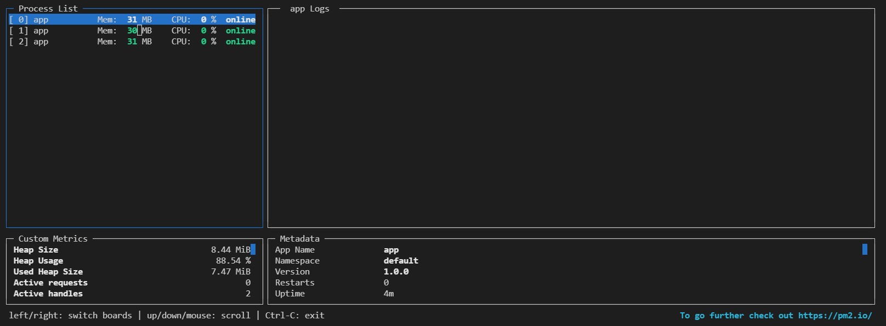
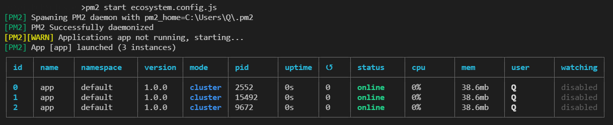

# NodeJS
## 클러스터 (Cluster)
+ CPU 코어를 모두 사용할 수 있게 해주는 모듈  
병렬로 실행된 서버의 개수만큼 요청이 분산됨. <**서버 성능 향상**>
  
```
npm i cluster
npm i http
npm i os
```
---
javascript
```javascript
const cluster = require('cluster');
const http = require('http');

const numCPUs = require('os').cpus().length;

if (cluster.isMaster) {
    console.log(`마스터 프로세스 아이디: ${process.pid}`);
    for (let i=0; i<numCPUs; i++) {
        cluster.fork(); // 워커 생성
    }
    // 워커 종료
    cluster.on('exit', (worker, code, signal) => {
        console.log(`${worker.process.pid}번 워커 종료`);
        console.log('code', code, 'signal', signal);
    })
} else {
    // http.createServer((req, res) => {
    //     res.writeHead(200, {
    //             'Content-Type': 'text/html; charset=utf-8'
    //         });
    //     res.write('<h1>Hello Node!</h1>');
    //     res.end('<p>Hello Cluster!</p>');
    //     setTimeout(() => { //워커가 존재하는지 확인하기 위해 1초마다 강제 종료
    //         process.exit(1);
    //     }, 1000);
    // }).listen(8086);

    const express = require('express');
    const app = express();
    const http = require('http').createServer(app);
    
    app.use(express.json());
    app.use(express.urlencoded({ extended: true }));

    app.set('port', process.env.PORT || 8086);

    app.get('/', (req, res) => {
        res.send('Hello Cluster!');
        setTimeout(() => {
            // 워커 존재하는지 확인하기 위해 1초마다 강제 종료
            process.exit(1);
        }, 1000);
    })

    http.listen(app.get('port'), () => {
        console.log(app.get('port'), 'port on');
    });

    console.log(`${process.pid}번 워커 실행`);
}

// ---------------------------------------------------
if (cluster.isMaster) {
    var worker = cluster.fork();

    // 생성한 워커가 보내는 메시지
    worker.on('message', (message) => {
        console.log('-----------------');
        console.log('To. 마스터');
        console.log(`${worker.process.pid} 워커의 메시지: ${message}`);
        console.log('-----------------');
    });

    // 생성한 워커에게 보내는 메시지
    worker.send('마스터가 보내는 메시지');
}

if (cluster.isWorker) {
    // 마스터가 보낸 메시지
    process.on('message', (message) => {
        console.log('-----------------');
        console.log('To. 워커');
        console.log(`마스터의 메시지: ${message}`);
        console.log('-----------------');
    });

    // 마스터에게 보내는 메시지
    process.send(`${process.pid} pid를 가진 워커가 보내는 메시지`);
}
```
  
결과
```py
마스터 프로세스 아이디: 13524
18880번 워커 실행
8086 port on
9012번 워커 실행
8086 port on
1160번 워커 실행
-----------------
To. 마스터
1160 워커의 메시지: 1160 pid를 가진 워커가 보내는 메시지
-----------------
-----------------
To. 워커
마스터의 메시지: 마스터가 보내는 메시지
-----------------
8086 port on
```


## pm2
+ NodeJS의 패키지 매니저(Package Manager)
```py
npm i -g pm2@latest

# fork mode
pm2 start app.js
pm2 start app.js --watch      # 변경사항이 있을 시 자동 리로드

# cluster mode
pm2 start app.js -i 1         # 코어의 개수 입력 or max(최대 코어 개수)
pm2 start app.js -i 0         # 최대
pm2 start app.js -i -1        # 인스턴스 1개 남기고 나머지 실행

# 상태 목록
pm2 list

# 종료
pm2 kill

# 로그 확인
pm2 logs

# 모니터링
pm2 monit

# configuation 파일 생성
pm2 ecosystem

# Actions

pm2 stop all                # Stop all processes
pm2 restart all             # Restart all processes

pm2 reload all              # Will 0s downtime reload (for NETWORKED apps)

pm2 stop 0                  # Stop specific process id
pm2 restart 0               # Restart specific process id

pm2 delete 0                # Will remove process from pm2 list
pm2 delete all              # Will remove all processes from pm2 list
```   
----  
  
```
pm2 monit
```

  
---  
  
ecosystem.config.js
``` javascript
module.exports = {
  apps : [{
    name: 'app',                        // pm2 name
    script: 'index.js',                 // 맵 실행 스크립트
    exec_mode: 'cluster',               // fort, cluster 모드 중 선택
    instances: 3,                       // 클러스터 모드 사용 시 생성할 인스턴스 수
    watch: false,                       // 파일이 변경되었을 때 재시작 여부
    merge_logs: true,                   // 클러스터 모드 사용 시 각 클러스터에서 생성되는 로그를 한 파일로 합쳐줌
    // autorestart: true,               // 프로세스 실패 시 자동 재시작 여부
    // max_memory_restart: "512M",      // 프로그램의 메모리 크기가 일정 크기 이상이 되면 재시작
    time: true,                         // pm2 log 에서 콘솔들의 입력 시간이 언제인지 확인 가능
    increment_var: 'PORT',              // 각 인스턴스에 대해 PORT 변수를 증가시킴
    env: {
      // 개발 환경 설정
      'PORT': 3001,
      'NODE_ENV': 'development',
    },
    env_production: {
      // 운영 환경 설정
      // 'PORT': 3000,
      'NODE_ENV': 'production',
    }
  }]
};

```
---
```
pm2 start ecosystem.config.js --name 앱 이름
pm2 start ecosystem.config.js --env
pm2 start ecosystem.config.js --env production
```
결과 - pm2 start ecosystem.config.js
